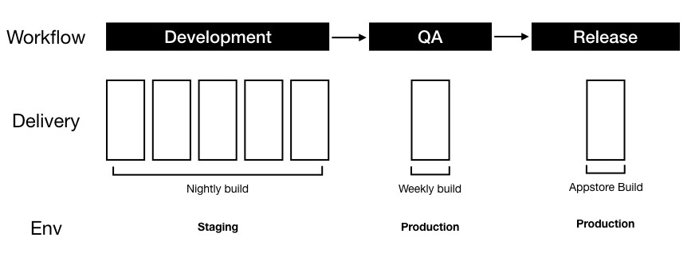

# 持续集成和持续交付

两种方式都是我们日常常用的工作流方式。通过下图就可以看到：

搭建这种工作流，需要思考从以下几个方面来。

## Git

存储代码使用，根据企业环境，来选择：

- GitHub
- Gitlab
- 本地 Server git
- 其他的 git 服务商

## CI

- Travis CI
- Circle CI
- Jenkins
- GitHub Action

## CD

- Fastlane （移动端来说）

## 总结

其实，构建这样的一种工作方式，目的就是让我们少的出错，提供稳定的软件服务。

## 扩展

掌握日常脚本语言，是非常有利于提高工作的效率的。

- Ruby
- Node
- Python
- Shell

大多的知名的工具，都是通过上面的脚本语言来实现的。所以，掌握它很重要。
