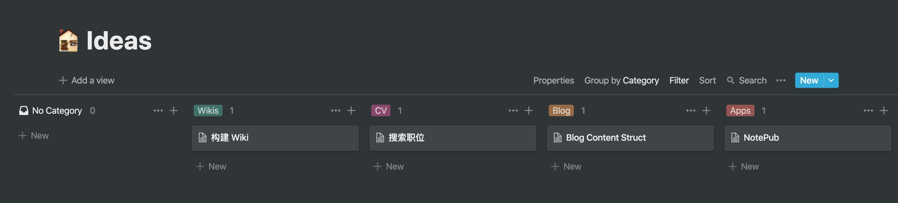

# 专注

真的是精力有限，想做的事情有很多，所以，当下必须要做好控制。

信息混乱，获取信息的方式，如何整理信息。

## Focusing on what's important

目的是要把事情给干成，输出结果。

使用 Notion 建立任务看板，平时，把脑子中的想法输入到看板中去。然后就是根据当前优先级，拆分可执行的 TODO 来进行操作。

Idea 看板记录平时，软件操作的一些想法。Goals 看板则来记录大方向的目标事情，比如周、季度、年度，想做的事。

把想做的事情，转化目标进行分级，然后执行，最后输出结果。

Wiki 来记录做事情中间的一些重要索引，把事情的结果最终分散到各个对应的结点上去。

## Notes

## Links
